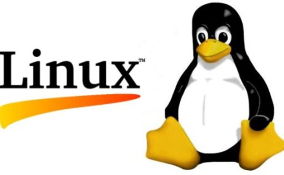

#  Upstart
#### * Upstart es un evento basado en el reemplazo del daemon /sbin/init el cual maneja el inicio de tareas y servicios durante el booting(booteo).Deteniendolas durante el apagado y supervisandolas mientras el sistema esta corriendo. *

#### * Fue desarrollado originalmente para la distro Ubuntu.Pero se intenta que sea adecuado para el despliegue en todas las distros Linux como un remplazo para System-V init. *

# HIGH LIGHTS
####  - Tareas y servicios son iniciados y detenidos por eventos.
#### -Eventos generados como tareas y los servicios son iniciados y detenidos.
#### -Los eventos talvez sean recibidos desde  algun otro proceso en el sistema.
#### -Los servicios talvez reaparezcan si mueren de forma inesperada.
#### -Supervisión y reaparición de daemons que separan de sus procesos padre.
#### -Comunicación con el init daemos sobre D-Bus
#### -Servicios de usuario, que pueden iniciar y detener ellos mismos.

# HIGH LIGHTS SCHEDULED
#### -Eventos generados en intervalos de tiempo o tiempos programados.
#### -Eventos generados como archivos o directorios son cambiados(in progress).

# ALGUNOS USUARIOS USUARIOS
#### - Ubuntu 6.10
#### - Fedora 9
#### - Google Chrome
#### - Chromium
#### - Nokia
#### - Debian(como opción).
